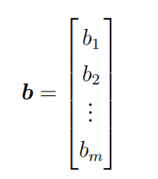
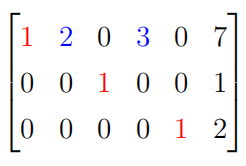
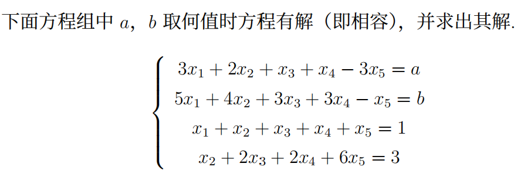

# 线性代数习题课 1
2025.9.23

---

# 自我介绍
- 李岷璨
- 23级数所 本科生
- QQ: 2661202177
- Wechat: hanyuguxingMC
- Email: limc2023@shanghaitech.edu.cn

---

# 关于习题课
- 时间：每周二 18:00 ~ 19:40（可灵活调整）
- 地点：信息学院 1D106

1. ~~交作业~~
  在 Gradescope 上提交作业
  习题课没有考勤，可以不来（除非有Quiz）
  考核方式：平时成绩（作业和小测）30%；
  期中考试 30%；期末考试 40%
2. 讲解部分上次作业题目
3. 回顾重难点知识
4. 其他讨论（例如同学们提出的有意思的问题，建议提前发给我）

---

# 关于作业
- **禁止抄袭!**
- 主要按完成度给分
- 鼓励讨论交流
- 合理使用AI，注意谨慎求证
- 可随时与我或者任何助教进行线上答疑

---

# 关于大学生活
- 多做尝试 Trial-and-Error
- 发展个性 Develop personality
- 勇气与策略 Courage and strategy
- ...

---

# 为什么学习线性代数?
- 重⾛⼀个学科从⽆到有的发现历程，理解学科中的基本思想、基本⽅法
- 它是高等数学的一块基石，在许多领域都有应用
- 它是许多其他课程的先修课程（如概率论与数理统计，机器学习，计算机视觉）
- ...

---

# 线性（linearity）一词何来
- linearity = additivity + homogeneity

1. additivity（加法）
  $f(x+y) = f(x) + f(y)$
2. homogeneity（数乘）
  $f(ax) = af(x)$

- 在本课程中，我们主要研究线性空间和线性变换。

---

# 作业
- 当且仅当
  $\Rightarrow$ 充分性，$\Leftarrow$ 必要性，都要证
  或者全程使用$\Leftrightarrow$等价表述

- 确定的否定：方程组无解或者有无穷多个解

- 高斯消元法：可能存在 $0=d$ 的行

- 特殊的线性子空间：只包含 $\vec{0}$

---

# 线性方程（组）

其中，$a_{ij}$ 是第 $i$ 个方程中第 $j$ 个未知数的系数，$b_{i}$ 是第 $i$ 个方程的常数项

如果解集非空，则称这个线性方程组是 *相容* 的，否则称该线性方程组 *不相容* 。如果解是唯一的，则称这个线性方程组是 *确定* 的。
> 线性方程组不确定 $\Rightarrow$ 线性方程组无解或者有无穷多个解

---
# 系数矩阵 & 增广矩阵
 
系数矩阵 $A$ 和增广矩阵 $\bar{A}=(A|\mathbf{b})$
- 特例：$\vec{b} = \vec{0}$ (常数项都为 $0$ )
  称为**齐次线性方程组**
  1. 一定有一组**平凡解**（零解）
  2. 可能有非平凡解
  > 齐次线性方程组中，一组非平凡解 $\Rightarrow$ 无限组非平凡解

---

# 向量

在增广矩阵中，常数项可以看成（列）向量

- 这也是一个 $m\times 1$ 矩阵

> 矩阵可以看作是一组列向量（行向量）

---
# 初等行变换
- 互换矩阵的两行；
- 将某一行乘一个非零常数；
- 将某一行乘一个非零常数加到另一行。

线性方程组的第 $i$ 个方程对应增广矩阵的第 $i$ 行，对线性方程组做初等变换等价于对其对应矩阵的行做相同的初等行变换

- 定理：初等变换不改变线性方程组的解

---

# 阶梯形矩阵 & 简化阶梯形矩阵

## 阶梯形矩阵
- 该矩阵中任何非零行里所包含的第一个非零的项称为**主元**
- 该矩阵中任何零行在非零行的下方
- 对于该矩阵中任意两个相邻的非零行，上面的行里所包含的**主元**位于下面的行里所包含的**主元**的左侧

## 简化阶梯形矩阵

- 阶梯形矩阵
- 该矩阵中任何非零行里所包含的**主元**都是1
- **主元**是其所在列的**唯一一个不为0**的项

---

# 一般矩阵化为阶梯形与简化阶梯形
- 首先浏览矩阵的所有行，找出所有非零行，并将所有零行全部移动到矩阵的下方，确保所有非零行都在零行的上方
- 在每个非零行里找出其包含的第一个不为 $0$ 的项所在的列。假设第 $i$ 行所包含的第一个不为 $0$ 的项所在的列是其中最靠左的，那么将第 $i$ 行与第一行进行交换。在交换过后得到的矩阵里，第一行所包含的第一个不为 $0$ 的项为第一行里的**主元**

---

- 假设现在所得到的矩阵里第一行的**主元**所在的列为第 $j$ 列，那么通过初等行变换将首行**主元**下方的所有项均消为 $0$ . 这一步的意图是确保首行所包含的**主元**处于最左边
- 现在可以暂时忘记第一行和第 $j$ 列，我们观察剩下的 $m−1$ 行和 $n−j$ 列 (假设原矩阵为 $m\times n$ 矩阵)，然后对其重复以上步骤。直到将其化为阶梯形为止
- 将该阶梯形里所有行包含的**主元**上方和下方的非零项通过初等行变换全部消为 $0$ ，并将所有**主元**变为 $1$ ，即可得到简化阶梯形

---

# 一般矩阵化为阶梯形与简化阶梯形

将这个矩阵化为阶梯形与简化阶梯形

---

# 高斯消元法
可以发现，一个线性方程组的增广矩阵经过初等行变换所得的阶梯形或简化阶梯形的形状，能够决定该方程组是否有解，以及有解时解是否唯一。

设某个由 $m$ 个 $n$ 元一次方程组成的线性方程组的增广矩阵为
$$B=(A, \mathbf{b})$$
（其中 $A$ 为系数矩阵），其对应的简化阶梯形为
$$R=(U, \mathbf{s})$$
（这里 $s$ 为矩阵 $R$ 最右边的一列）

---

# 高斯消元法
- 若存在某个 $i\in\{1,\dots,m\}$ ，使得矩阵 $U$ 的第 $i$ 行全为 $0$ ，而列向量 $s$ 的第 $i$ 个坐标 $s_i\neq 0$ ，则该方程组**无解**；否则该方程组**至少有一个解**

- 若方程有解且 $U=I_n$（ $n\times n$ 的单位矩阵）（不考虑 $U$ 的零行），则方程组**有且只有一个解**，且解向量为 $\vec{s}$ 的前 $n$ 个坐标

- 若方程有解且 $U\ne I_n$（不考虑 $U$ 的零行），则方程组**有无穷多个解**

---

# 线性方程组的解的可能情形
1. 无解
2. 唯一解
3. 无穷多个解

- 平凡解（零解）：$\vec{x} = \vec{0}$ 是齐次线性方程组的特解

- 对于非齐次线性方程组 $Ax=\mathbf{b}$ ，如果相容，
  通解 = 特解（非齐次情形）+ 非平凡解（齐次情形 $Ax=\vec{0}$ ，若不存在非平凡解则通解唯一）

  > 可以想想什么时候 $Ax=\vec{0}$ 只有平凡解

---

# 主未知元 & 自由变量

令 $B$ 是一个线性方程组的增广矩阵, 它的阶梯形是 $\tilde{B}$

$\tilde{B}$ 的每一个非零行所包含的第一个不为 $0$ 的项对应的未知数被称为该方程组的**主未知元**，主未知元之外的所有未知数被称为该方程组的**自由变量**

- 容易看出，设某个含有 $n$ 个未知数的线性方程组的增广矩阵为 $B$，$\tilde B$ 与 $R$ 分别为由 $B$ 得到的阶梯形与简化阶梯形，则该方程组主未知元的个数 $k$ 为 $\tilde B$ 或者 $R$ 里主元的个数（非零行的个数），该方程组自由变量个数为 $n-k$

---

# 主未知元 & 自由变量

---

通解:

$x_1 = 7 − 3r − 2s, x_2 = s, x_3 = 1, x_4 = r, x_5 = 2$

$r, s\in \mathbb{R}$

特解：

令 $r = 1$, $s = 1$, 得$x_1 = 2, x_2 = 1, x_3 = 1, x_4 = 1, x_5 = 2$

---

# 低阶行列式
矩阵 $A = 
\begin{pmatrix}
  a & b \\
  c & d
\end{pmatrix}
$ ，其行列式为 $|A|=ad-bc$

矩阵 $B=
\begin{pmatrix}
a_{11} & a_{12} & a_{13} \\
a_{21} & a_{22} & a_{23} \\
a_{31} & a_{32} & a_{33}
\end{pmatrix}
$ ，其行列式为 $|B|=a_{11}a_{22}a_{33}+a_{12}a_{23}a_{31}+a_{13}a_{21}a_{32}-a_{31}a_{22}a_{13}-a_{32}a_{23}a_{11}-a_{33}a_{21}a_{12}$

---

# 低阶行列式
给定二元线性方程组 $\begin{equation}
\begin{cases}
a_{11}x_{1}+a_{12}x_{2}=b_{1}\\
a_{21}x_{1}+a_{22}x_{2}=b_{2}
\end{cases}
\end{equation}$，如果 $a_{11}a_{22}-a_{12}a_{21}\neq 0$ ，那么方程组的解为：
$$
\begin{aligned}
x_1&=\dfrac{\left|\begin{matrix} b_1 & a_{12}\\ b_2 & a_{22}\end{matrix}\right|}
               {\left|\begin{matrix} a_{11} & a_{12}\\ a_{21} & a_{22}\end{matrix}\right|}
,\quad
x_2=\dfrac{\left|\begin{matrix} a_{11} & b_1\\ a_{21} & b_2\end{matrix}\right|}
            {\left|\begin{matrix} a_{11} & a_{12}\\ a_{21} & a_{22}\end{matrix}\right|}
\end{aligned}
$$

---
# 低阶行列式

给定三元线性方程组 $\begin{equation}
\begin{cases}
a_{11}x_{1}+a_{12}x_{2}+a_{13}x_{3}=b_{1}\\
a_{21}x_{1}+a_{22}x_{2}+a_{23}x_{3}=b_{2}\\
a_{31}x_{1}+a_{32}x_{2}+a_{33}x_{3}=b_{3}
\end{cases}
\end{equation}$ ，如果方程组的系数矩阵的行列式不为 $0$ ，那么方程组的解为：
$$
\begin{aligned}
x_1&=\dfrac{\left|\begin{matrix}
b_1 & a_{12} & a_{13}\\
b_2 & a_{22} & a_{23}\\
b_3 & a_{32} & a_{33}
\end{matrix}\right|}
{\left|\begin{matrix}
a_{11} & a_{12} & a_{13}\\
a_{21} & a_{22} & a_{23}\\
a_{31} & a_{32} & a_{33}
\end{matrix}\right|}
,\quad
x_2=\dfrac{\left|\begin{matrix}
a_{11} & b_1 & a_{13}\\
a_{21} & b_2 & a_{23}\\
a_{31} & b_3 & a_{33}
\end{matrix}\right|}
{\left|\begin{matrix}
a_{11} & a_{12} & a_{13}\\
a_{21} & a_{22} & a_{23}\\
a_{31} & a_{32} & a_{33}
\end{matrix}\right|}
,\quad
x_3=\dfrac{\left|\begin{matrix}
a_{11} & a_{12} & b_1\\
a_{21} & a_{22} & b_2\\
a_{31} & a_{32} & b_3
\end{matrix}\right|}
{\left|\begin{matrix}
a_{11} & a_{12} & a_{13}\\
a_{21} & a_{22} & a_{23}\\
a_{31} & a_{32} & a_{33}
\end{matrix}\right|}
\end{aligned}
$$
> 可以猜猜n元线性方程组解的公式？
---

# 克拉默法则
若线性方程组
$$
\begin{cases}
a_{11}x_1+\cdots+a_{1n}x_n=b_1,\\
\quad\vdots\\
a_{n1}x_1+\cdots+a_{nn}x_n=b_n
\end{cases}
$$
的系数矩阵可逆，则它有唯一解：
$${\scriptsize
x_k=
\dfrac{
\left|
\begin{matrix}
a_{11} & \cdots & b_{1} & \cdots & a_{1n}\\
\vdots &        & \vdots&        & \vdots\\
a_{n1} & \cdots & b_{n} & \cdots & a_{nn}
\end{matrix}
\right|
}{
\left|
\begin{matrix}
a_{11} & \cdots & a_{1k} & \cdots & a_{1n}\\
\vdots &        & \vdots &        & \vdots\\
a_{n1} & \cdots & a_{nk} & \cdots & a_{nn}
\end{matrix}
\right|
},
~~~~k=1,2,\ldots,n
}$$
其中分子由常数列代替系数矩阵的行列式的第 $k$ 列得到。

---
# 线性空间（向量空间）
- 称集合 $V$ 是域 $F$ 上的线性空间，如果 $V$ 上有加法运算且 $F$ 中的元素与 $V$ 中的元素可以相乘得到 $V$ 中的元素，且这两个运算具有八条性质（加法交换律、加法结合律、零向量、负向量、幺元、乘法结合律、两个分配律）
$\mathbb{R}^n$ 就是典型的线性空间
$\mathbf{v}\in\mathbb{R}^n$, $\mathbf{v}=(v_1,\cdots,v_n)$
  > 次数 $\leq n$ 的多项式全体，区间 $[a,b]$ 上的所有连续函数也是线性空间

- 线性组合 
  $\mathbf{w} = k_1\mathbf{v}_1 + k_2\mathbf{v}_2 + \cdots + k_r\mathbf{v}_r$

---
# 线性空间（向量空间）
- 子空间
  称向量空间 $V$ 的非空子集 $U$ 为 $V$ 的线性子空间，如果 $U$ 中任意两个元素的所有线性组合仍在 $U$ 中
  子空间自身也是一个向量空间
  只含有零向量的子空间称为零子空间
  子空间的交仍是子空间，子空间的并通常不是子空间

- 张成
  $
  <\mathbf{v}_1,\mathbf{v}_2,\cdots,\mathbf{v}_r>=\{k_1\mathbf{v}_1 + k_2\mathbf{v}_2 + \cdots + k_r\mathbf{v}_r, k_1,\cdots,k_r\in\mathbb{R}\}$

---

# 线性空间（向量空间）
- " $+$ "是一种抽象运算，在一般情形下不一定是欧几里得空间（即 $\mathbb{R}^n$ ）里的加法
  例如，我们可以定义 $a + b = ab$
- $-u$ 是 $u$ 的逆元（即“负元”），在一般情形下可能有 $-u \ne -1u$ ；  
  **但在向量空间中**，$-u = -1u$
- 向量空间有如下性质：
  - $0u = 0$
  - $k0 = 0$
  - $(-1)u = -u$
  - $a(-v)=-av$
  - $cu = 0 \Rightarrow c = 0$ 或 $u = 0$ 
  - $a(u-v)=au-av,(a-b)v=av-bv$

---
# 线性相关 & 线性无关
$\mathbf{v}_1,\cdots,\mathbf{v}_r$ 线性相关：$k_1\mathbf{v}_1 + k_2\mathbf{v}_2 + \cdots + k_r\mathbf{v}_r=\mathbf{0}$ 存在非平凡解
$\mathbf{v}_1,\cdots,\mathbf{v}_r$ 线性无关：$k_1\mathbf{v}_1 + k_2\mathbf{v}_2 + \cdots + k_r\mathbf{v}_r=\mathbf{0}$ 只有平凡解（零解）

- 引理：$\mathbf{v}_1,\cdots,\mathbf{v}_r$ 线性相关当且仅当其中至少有一个向量是其余向量的线性组合

  > 如果向量组线性相关，那么每一个向量都可以表示成其余向量的线性组合吗？

- 引理：设向量组 $S$ 是向量组 $T$ 的一个子集。那么，如果 $S$ 线性相关，则 $T$ 也线性相关；反之，如果 $T$ 线性无关，则 $S$ 也线性无关。
  > 如果向量组的任何不是它本身的子向量组都线性无关，该向量组也线性无关吗？

  > 证明向量组线性无关的常用方法是反证法

---

# 基 & 维数 & 秩
基：线性子空间中的任何向量都可以唯一表示成基的线性组合
维数：线性子空间的基所含的向量个数
秩：向量组张成的线性子空间的维数/向量组的极大线性无关组所含的向量个数

---

# 习题

---

# 习题
设
$
A=\begin{bmatrix}
1 & 1 & 2\\
2 & 3 & 7\\
a & 0 & -a
\end{bmatrix},\quad
B=\begin{bmatrix}
1 & 0 & -1\\
a & 1 & 1\\
2 & 1 & 1
\end{bmatrix},
$

其中 $a$ 为常数。假设 $B$ 可通过对 $A$ 进行一系列初等行变换得到，求 $a$ 的值。

---

# 习题

