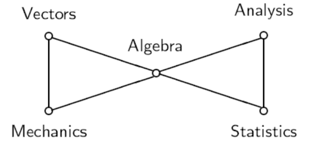
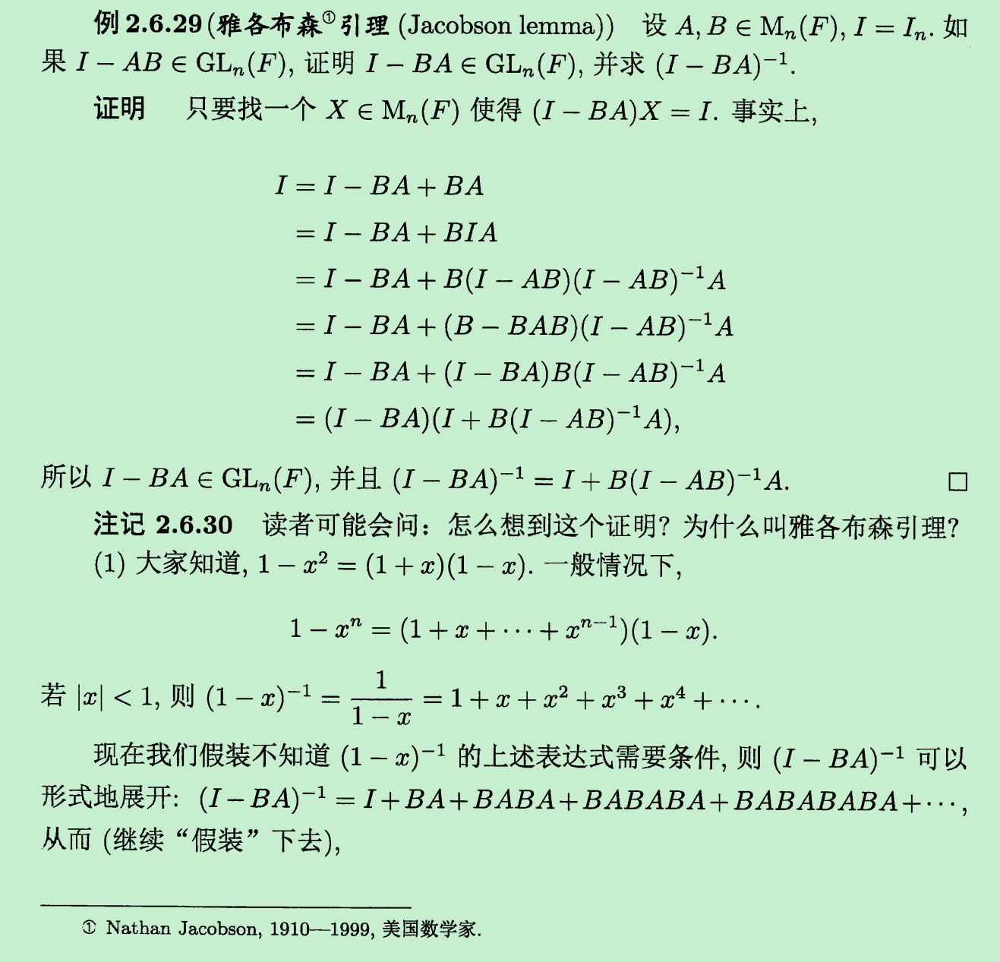
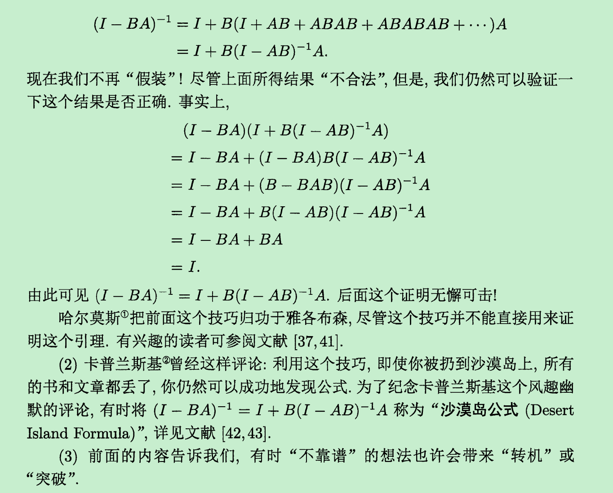

# 线性代数习题课 4
2025.10.21

---

---
# 初等矩阵
第一类 $F_{i,j}$ ：将单位矩阵的第 $i$ 行与第 $j$ 行互换（将单位矩阵的第 $i$ 列与第 $j$ 列互换）
第二类 $F_i(\lambda)$ ：将单位矩阵第 $i$ 行乘以非零数 $\lambda$（将单位矩阵第 $i$ 列乘以非零数 $\lambda$）
第三类 $F_{i,j}(\lambda)$ ：将单位矩阵第 $j$ 行的 $\lambda$ 倍加到第 $i$ 行（将单位矩阵第 $i$ 列的 $\lambda$ 倍加到第 $j$ 列）

上述三类方阵称为**初等矩阵**。每一类初等矩阵与一类初等变换相对应

对矩阵作初等行变换，等价于在矩阵左边乘上一个相应的初等矩阵；对矩阵作初等列变换，等价于在矩阵右边乘上一个相应的初等矩阵
> **左行右列**法则

---
# 初等矩阵
- $F_{ij}$ 为对称矩阵，且 $F_{ij}^{-1}=F_{ij}$
- $F_i(\lambda)$ 为对角矩阵，且 $F_i(\lambda)^{-1}=F_i(\lambda^{-1})$
- $F_{ij}(\lambda)$ 为三角矩阵，且 $F_{ij}(\lambda)^{-1}=F_{ij}(-\lambda)$

对任意矩阵 $A=(a_{ij})_{m\times n}$，存在一系列 $m$ 阶初等矩阵 $P_1,P_2,\ldots,P_s$ 和 $n$ 阶初等方阵 $Q_1,Q_2,\ldots,Q_t$，使得 $P_s\cdots P_2P_1\,A\,Q_1Q_2\cdots Q_t
=\begin{pmatrix}
I_r & 0\\
0 & 0
\end{pmatrix}
$

对任意矩阵 $A=(a_{ij})_{m\times n}$，存在 $m$ 阶可逆矩阵 $P$ 和 $n$ 阶可逆方阵 $Q$，使得 $
PAQ=
\begin{pmatrix}
I_r & 0\\
0 & 0
\end{pmatrix}
$

上面非负整数 $r=\operatorname{rank}(A)$

---
# 矩阵的分块

类似一般的初等矩阵，引入三种**分块初等矩阵**（对应分块初等变换，左行右列法则依然适用）：

$
\begin{bmatrix}
P & O\\
O & I
\end{bmatrix}
$ 表示第一行左乘可逆矩阵 $P$ ，或者第一列右乘可逆矩阵 $P$

$
\begin{bmatrix}
O & I\\
I & O
\end{bmatrix}
$ 表示第一行与第二行（或者第一列与第二列）互换

$
\begin{bmatrix}
I & O\\
P & I
\end{bmatrix}
$ 表示把第一行左乘矩阵 $P$（不一定可逆）加到第二行，或者第二列右乘矩阵 $P$ 加到第一列

---
# 矩阵的分块
### 分块三角矩阵的逆矩阵
$A\in\mathbb{R}^{m\times m},\; D\in\mathbb{R}^{n\times n},\; B\in\mathbb{R}^{m\times n},\; C\in\mathbb{R}^{n\times m}$

分块上三角：$U=\begin{bmatrix}A & B\\ O & D\end{bmatrix}$ $~~~~~$ 分块下三角： $L=\begin{bmatrix}A & O\\ C & D\end{bmatrix}$

若 $A$ 与 $D$ 可逆，则
$
U^{-1}
=\begin{bmatrix}
A^{-1} & -A^{-1}BD^{-1}\\
O & D^{-1}
\end{bmatrix}~~~~~
L^{-1}
=\begin{bmatrix}
A^{-1} & 0\\
-D^{-1}CA^{-1} & D^{-1}
\end{bmatrix}
$

$U$ 可逆 $\iff$ $A$ 与 $D$ 均可逆
$L$ 可逆 $\iff$ $A$ 与 $D$ 均可逆

---
# 逆矩阵的计算
同时对 $A$ 与 $I$ 施行相同的初等行变换；当把 $A$ 化为 $I$ 时，$I$ 即化为 $A^{-1}$：

$
(A\,|\,I)\xRightarrow{\,P_{1}\,}(P_1A\,|\,P_1I)
\xRightarrow{\,P_{2}\,}\cdots
\xRightarrow{\,P_{k}\,}
\bigl(P_k\cdots P_2P_1A\;\big|\;P_k\cdots P_2P_1I\bigr)
=(I\,|\,A^{-1})
$

---
# 逆矩阵的计算
判断下面的矩阵是否可逆，如果可逆，计算其逆矩阵:

$
A=\begin{pmatrix}
3 & 3 & -5 & -6\\
1 & 2 & -3 & -1\\
2 & 3 & -5 & -3\\
-1 & 0 & 2 & 2
\end{pmatrix}
$

---
# 线性方程组的解空间
线性映射 $\varphi:\mathbb{R}^n \to \mathbb{R}^m$，其核 $\ker \varphi=\{X\in\mathbb{R}^n \mid \varphi(X)=0\}$ 是 $\mathbb{R}^n$ 的线性子空间，其像 $\operatorname{im}\varphi=\{\varphi(X)\mid X\in\mathbb{R}^n\}$ 是 $\mathbb{R}^m$ 的线性子空间

$$
\dim(\operatorname{im}\varphi)=\operatorname{rank}(A)~~~~
\dim(\operatorname{ker}\varphi)= n-\operatorname{rank}(A)
$$
$$
\dim(\operatorname{im}(\varphi))+\dim(\operatorname{ker}(\varphi))=n
$$

设 $A$ 为 $m\times n$ 实矩阵，定义线性映射
$$
\varphi_A:\mathbb{R}^n\to\mathbb{R}^m,~~X\mapsto AX
$$
- 线性方程组 $AX=0$ 的解空间 $S$ 就是 $\varphi_A$ 的核 $\ker\varphi_A$
- 矩阵 $A$ 的列空间 $V_c=\langle a_1,\ldots,a_n\rangle$ 就是 $\varphi_A$ 的像集 $\operatorname{im}\varphi_A$

---
# 习题
证明西尔维斯特秩不等式：设 $A,B$ 分别是 $s\times n,n\times m$ 矩阵，则 $\operatorname{rank}(A)+\operatorname{rank}(B)-s\le\operatorname{rank}(AB)$

---
# 习题
设 $A,B$ 为同阶方阵，证明：$\operatorname{rank}(AB-I)\le \operatorname{rank}(A-I)+\operatorname{rank}(B-I)$
