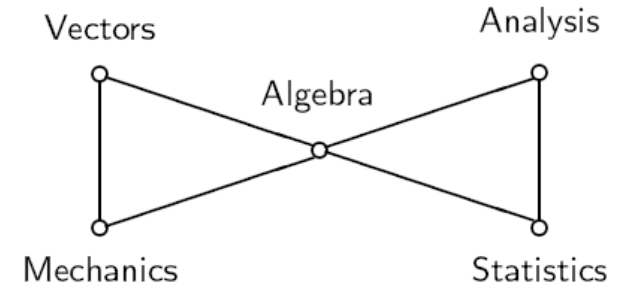

# 线性代数习题课 2
2025.9.28

---

# 作业
- 自由变量的取值范围
  $eg.$ $x_3=s,x_4=r$
  **$s,r\in \mathbf{R}$**

- 证明子空间，无需单独考虑零子空间，只需交代子集非空即可

- 以后在Gradescope上提交作业，课程代码为GVY2KN，如有操作使用方面的问题请联系助教

---
# 极大线性无关组
设 $S$ 是一组向量，$S_1$ 是 $S$ 的子向量组。若 $S_1$ 线性无关，且对任意向量 $a \in S \setminus S_1$，$S_1 \cup \{a\}$ 线性相关，则称 $S_1$ 是 $S$ 的**极大无关组**
> 这个定义比较重要：当证明有关极大无关组的等价结论时，请从最原始的定义出发证明

---
# 向量组的秩
设向量 $a_1,a_2,\ldots,a_m\in \mathbb{R}^n$，则有：

1. $a_1,\ldots,a_m$ 线性无关，当且仅当 $\operatorname{rank} (a_1,\ldots,a_m)=m$；
2. $a_1,\ldots,a_m$ 线性相关，当且仅当 $\operatorname{rank} (a_1,\ldots,a_m)<m$；
3. 若 $\{b_1,\ldots,b_n\}$ 可以用 $\{a_1,\ldots,a_m\}$ 线性表示，则 $\operatorname{rank}(b_1,\ldots,b_n)\le \operatorname{rank}(a_1,\ldots,a_m)$；
4. 若 $\{b_1,\ldots,b_n\}$ 与 $\{a_1,\ldots,a_m\}$互相可以线性表示，则 $\operatorname{rank}(b_1,\ldots,b_n)=\operatorname{rank}(a_1,\ldots,a_m)$；
5. 向量 $b$ 可表示成 $\{a_1,\ldots,a_m\}$ 的线性组合，当且仅当 $\operatorname{rank}(a_1,\ldots,a_m)=\operatorname{rank}(a_1,\ldots,a_m,b)$
---
# 矩阵的秩
矩阵$A$的行向量张成的线性子空间称为行空间，其维数称为$A$的行秩
矩阵$B$的列向量张成的线性子空间称为列空间，其维数称为$A$的行秩

引理：初等行变换不改变矩阵的行秩/列秩
（2.14引理的证明可能比较抽象，建议同学们多看看教材这一块内容，思路是初等行变换前后两个行向量组可以互相线性表示，列向量组的线性相关性不受改变）

---
# 矩阵的秩
定理：矩阵$A$的行秩和列秩相等，这个数称为矩阵$A$的**秩**，记作 $\operatorname{rank}(A)$

- 因此，矩阵阶梯形的非零行数/主元数目就是矩阵的秩，并且阶梯形的主元所在的列构成列向量组的一个极大线性无关组
- 上一页的引理陈述便可改为：

定理：初等行变换不改变矩阵的秩

---

# 矩阵的秩
设 $a_1,a_2,\ldots,a_m \in \mathbb{R}^n$ 为一组列向量，$A=(a_1,a_2,\ldots,a_m)$ 为以 $a_1,a_2,\ldots,a_m$ 为列构成的 $n\times m$ 阶矩阵。$A$ 经一系列初等行变换变为矩阵 $B=(b_1,b_2,\ldots,b_m)$，则：

1. $a_1,a_2,\ldots,a_m$ 线性相关（无关）当且仅当 $b_1,b_2,\ldots,b_m$ 线性相关（无关）
2. $a_{i_1},a_{i_2},\ldots,a_{i_r}$ 为 $a_1,a_2,\ldots,a_m$ 的极大无关组，当且仅当 $b_{i_1},b_{i_2},\ldots,b_{i_r}$ 为 $b_1,b_2,\ldots,b_m$ 的极大无关组。其中 $1\le i_1<\cdots<i_r\le m$

---
# 子空间的若干结论
$n$ 维欧氏空间 $\mathbb{R}^n$ 中的下列结论成立

1. 设 $V \subset \mathbb{R}^n$ 为 $r$ 维子空间，则 $V$ 中任意 $r+1$ 个向量线性相关
2. 设 $V$ 为 $r$ 维子空间，则 $V$ 中任意 $r$ 个线性无关的向量为 $V$ 的一组基
3. 设 $U$ 与 $V$ 为 $\mathbb{R}^n$ 的子空间，且 $U \subseteq V$，则 $\dim U \le \dim V$
4. 设 $U$ 与 $V$ 为 $\mathbb{R}^n$ 的子空间，且 $U \subseteq V$，若 $\dim U=\dim V$，则 $U=V$

---

# 子空间的和与直和
上节课我们知道，设 $U,V$ 是$\mathbb{R}^n$的两个子空间，容易验证 $U \cap V$也是$\mathbb{R}^n$的子空间，但$U \cup V$一般而言不是$\mathbb{R}^n$的子空间
我们把 $U \cup V$ 张成的子空间称为$U$与$V$的**和**，记作 $U+V$ ：$U+V=\{u+v \mid u\in U, v\in V\}$
- 定理：设$U$和$V$是的$\mathbb{R}^n$的子空间，则$\dim (U+V)=\dim U+ \dim V - \dim U\cap V$
---

# 子空间的和与直和
可以证明，$U\cap V = \{\mathbf{0}\}$ 当且仅当对于任意的 $x\in U+V$，存在唯一的$u\in U$和唯一的$v\in V$使得 $x=u+v$. 这时称 $U+V$ 为**直和**，记作 $U\oplus V$
- 定理：$U+V$是直和当且仅当如果 $u+v=\mathbf{0}$, $u\in U$, $v\in V$, 则$u=v=\mathbf{0}$

因此，如果子空间$U$与$V$的和为直和，我们也称$U$与$V$线性无关

- 定理：如果$U\cap V= \{0\}$，则$\dim (U+V)=\dim U+ \dim V$

---

# 线性方程组的可解性准则
设 $A \in \mathbb{R}^{m\times n}$ 为$m\times n$阶矩阵，$\mathbf{b} \in \mathbb{R}^m$ 为$m$维列向量，则一般线性方程组 $A\mathbf{x}=\mathbf{b}$ 有解的充要条件是 $\operatorname{rank}(A)=\operatorname{rank}(A,\mathbf{b})$，线性方程组有唯一解的充要条件是 $\operatorname{rank}(A)=\operatorname{rank}(A,\mathbf{b})=n$

齐次线性方程组 $A\mathbf{x}=\mathbf{0}$ 有非零解的充要条件是 $\operatorname{rank}(A)<n$

---

# 向量组等价
给定两个向量组 $S=\{a_1,\ldots,a_m\}$，$T=\{b_1,\ldots,b_r\}$，若$S$中的每个向量都可由$T$中的向量线性表示，则称$S$可以由$T$线性表示。如果两个向量组互相都可以线性表示，则称$S$与$T$等价，记为$S\sim T$
- 容易验证，向量组的等价具有自反性，对称性，传递性
- 容易验证，两个向量组等价当且仅当它们张成的子空间相同

---
# 向量组等价
- 向量组与它的任何一个极大线性无关组等价
- 等价的线性无关向量组所含向量的个数相等
- 等价的向量组有相等的秩

---
# 习题
设$A$是 $s\times n$ 矩阵，$B$是 $l\times m$ 矩阵，证明：$
\operatorname{rank}
\begin{pmatrix}
A & 0\\
0 & B
\end{pmatrix}
= \operatorname{rank}(A)+\operatorname{rank}(B).
$

---

# 习题
证明：$
\operatorname{rank}(\mathbf{a_1},\mathbf{a_2},\dots,\mathbf{a_r},\mathbf{b_1},\mathbf{b_2},\dots,\mathbf{b_s})
\le
\operatorname{rank}(\mathbf{a_1},\mathbf{a_2},\dots,\mathbf{a_r})
+
\operatorname{rank}(\mathbf{b_1},\mathbf{b_2},\dots,\mathbf{b_s})
$

---
# 习题

设向量组 $S=\{\alpha_1,\dots,\alpha_s\}$ 线性无关，并且可以由向量组 $T=\{\beta_1,\dots,\beta_t\}$ 线性表示。证明：可以用向量 $\alpha_1,\dots,\alpha_s$ 替换向量 $\beta_1,\dots,\beta_t$ 中某 $s$ 个向量 $\beta_{i_1},\dots,\beta_{i_s}$，使得得到的向量组 $\{\alpha_1,\dots,\alpha_s,\ \beta_{i_{s+1}},\dots,\beta_{i_t}\}$ 与 $\{\beta_1,\dots,\beta_t\}$ 等价
（其中 $i_1,\dots,i_t$ 为 $\{1,\dots,t\}$的某个排列）

---
# 习题
（教材2.2节 习题4）
设 $m\times n$ 矩阵 $A=(a_{ij})$的行秩为 $r$，列秩为 $s$  
取 $A$ 的 $r$ 个线性无关的行向量 $A_{i_1},A_{i_2},\ldots,A_{i_r}$. 这 $r$ 个行向量形成一个 $r\times n$ 矩阵 $\widetilde{A}$. 设 $\widetilde{A}$ 的列秩为 $t$，$\tilde a_{j_1},\tilde a_{j_2},\ldots,\tilde a_{j_t}$ 是 $\widetilde{A}$ 的列向量的极大线性无关组。证明：
1) $t\le r$
2) 矩阵 $A$ 的任何一个列向量 $a_j$ 都是列向量$\tilde a_{j_1},\tilde a_{j_2},\ldots,\tilde a_{j_t}$ 的线性组合，从而 $s\le t\le r$，即列秩不超过行秩 
*提示：利用 $A$ 的任一行向量都是 $A_{i_1},A_{i_2},\ldots,A_{i_r}$ 的线性组合*

--- 
# 习题
3) 把 $A$ 的行作为列，得到如下 $n\times m$ 矩阵，称为 $A$ 的转置：
$
{}^{t}\!A=
\begin{pmatrix}
a_{11} & a_{21} & \cdots & a_{m1}\\
a_{12} & a_{22} & \cdots & a_{m2}\\
\vdots & \vdots & \ddots & \vdots\\
a_{1n} & a_{2n} & \cdots & a_{mn}
\end{pmatrix},
$
有 $r_c({}^{t}\!A)=r_r(A)$, $r_r({}^{t}\!A)=r_c(A)$.

结合 (2) 与 (3) 可知 $s\le r$ 且 $r\le s$，因此 $r=s$